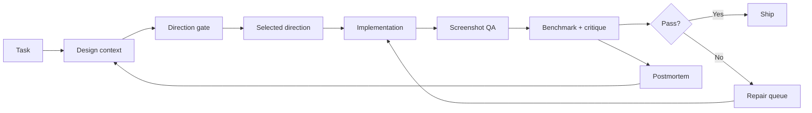

# Miguel Design OS

**A design-memory and quality system for AI-assisted frontend work.**

Miguel Design OS turns personal visual judgment into reusable engineering context: approved references, rejected patterns, design rules, task-specific skills, benchmark gates, screenshot QA, and post-build critique.

It exists to solve a practical problem: **an AI coding agent can remember code conventions more easily than taste.** This repository makes taste inspectable.

## The loop



## What is stored here

```text
design-dna/                 compact design rules + quality bars
visual-library/             approved / rejected / inspiration references
skills/                     routeable specialist workflows
evaluation/benchmarks/      task-mode scorecards
templates/                  prompts, reports and repeatable artifacts
captures/                   responsive screenshot evidence
design-intelligence/        navigation, visualization and pattern guidance
docs/qa/                    review evidence + postmortems
```

## Why it is different from a component library

A component library answers *“how should this button look?”*

Design OS is built for higher-level questions:

- Is the page composition generic?
- Did the app turn into card soup?
- Is the navigation part of the art direction or just boilerplate?
- Did a mobile sheet cut off?
- Is the chart carrying information or acting as decoration?
- Did the implementation preserve the selected design direction?
- Does the finished UI still resemble an AI default?

The output is not a palette. It is a **decision system**.

## Direction before implementation

For major visual work, the system forces a compact direction gate before code:

```text
brief
  ↓
direction A / B / C
  ↓
layout map + risk check
  ↓
human selects direction
  ↓
visual spec + tokens + navigation strategy
  ↓
implementation
```

Selection is treated as implementation approval unless the task is explicitly planning-only. This removes the common AI-agent loop where the system repeatedly asks permission after the visual direction has already been chosen.

## Explore the system

**[Design principles](./design-dna/)** — visual rules and quality criteria.

**[Task workflows](./skills/)** — focused instructions for implementation and review.

**[Reference library](./visual-library/)** — examples used to inform design decisions.

**[Evaluation](./evaluation/)** — review criteria and benchmarks.

Design OS is a repository of design knowledge and workflows, not a standalone dashboard. Screenshots of reference applications are not presented as its own interface.

## Quality layers

### Anti-AI-slop gate

The system explicitly checks for recurring failure modes: default SaaS composition, unnecessary containers, weak hierarchy, generic gradients/glow, decorative charts, template navigation, and visual motifs with no product meaning.

### Text clarity review

Finished interfaces are reviewed for vague labels, generic copy, inconsistent terminology, and content that sounds generated rather than written for the product.

### Production hardening

Visual polish is not enough. Review includes long content, empty/error/loading states, responsive stress, accessibility, slow networks, dense data, i18n pressure, and reduced motion.

### Visualization integrity

Charts, maps, diagrams, node graphs, floor plans and canvas-like objects require an explicit model: coordinate system, data contract, label strategy, collision rules, interaction state, responsive behavior, and accessibility.

## Design memory, not blind cloning

References are tagged by role:

- **approved** — mechanics worth repeating;
- **rejected** — known failure patterns;
- **inspiration** — useful but not yet a global rule;
- **case studies** — lessons from previous builds.

The system extracts hierarchy, density, composition and interaction principles. It does not blindly copy brand styling.

## Cost safety

Paid image-generation and plan-gated design features are opt-in, not automatic. Agent workflows must stop rather than silently consume paid credits.

## Using the system

Start with:

```text
AGENTS.md
design-dna/00_COMPACT_AGENT_CONTEXT.md
visual-library/README.md
```

Then select the task mode and route into the relevant skill / benchmark instead of loading the entire repository into context.

## What this project demonstrates

- design systems beyond reusable components;
- human taste encoded as inspectable constraints;
- AI-agent workflow architecture;
- screenshot-based QA;
- responsive design validation;
- critique → repair loops;
- explicit cost and quality gates;
- product-design judgment translated into engineering artifacts.

---

Built and continuously dogfooded by [Miguel Almeida](https://github.com/miguelalmeida0).


[Repository guide](./docs/START_HERE.md)

<!-- repository-presentation-repair:1 -->
